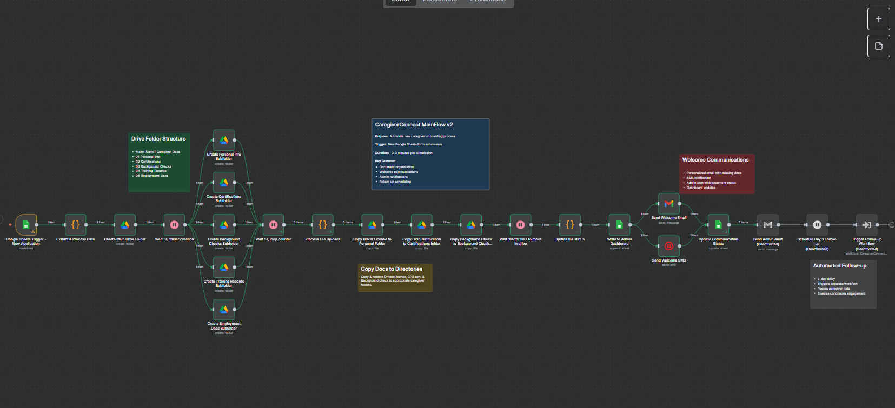

## Caregiver Connect Onboarding Tool MVP

**AI-powered caregiver onboarding automation for home care agencies. Reduces 90-day turnover by 25% through intelligent communication sequences and document management. Built with n8n, Google ecosystem, and Twilio. 48-hour deployable MVP with proven ROI.**

## Build Progress

### ✅ Completed Components
- [x] Google Form: `CaregiverConnect_Intake_v1`
- [x] Form Response Sheet: `CaregiverConnect_Database_v1` 
- [x] Admin Dashboard: `CaregiverConnect_AdminDashboard_v1`
- [x] Google Drive folder structure
- [x] File upload organization: `06_CaregiverConnect_FileUploads_v1`
- [x] n8n Main Workflow: `CaregiverConnect_MainFlow_v1`
- [x] n8n Document Processing
- [x] n8n Communication Sequence
- [x] Twilio SMS integration
- [x] Gmail welcome templates
- [x] Demo data population
- [x] End-to-end testing

## Current Architecture

**Data Flow:**
1. Google Form → Form Response Sheet
2. n8n Trigger → Process new submissions
3. Create organized Drive folders
4. Move files from uploads to caregiver folders
5. Update Admin Dashboard with tracking data
6. Send welcome communications
   


## Key Features

- **Smart Intake Processing**: Google Forms with conditional logic and automated document organization
- **Intelligent Communication**: Personalized SMS/email sequences via n8n workflows and Twilio
- **Document Management**: Automated Google Drive folder creation and compliance tracking
- **Admin Dashboard**: Real-time caregiver status monitoring via Google Sheets
- **Demo-Ready**: Live proof-of-concept system deployable in 48 hours

## Technology Stack

- **Frontend**: Google Forms
- **Database**: Google Sheets
- **Storage**: Google Drive
- **Automation**: n8n workflows
- **Communication**: Twilio (SMS) + Gmail (Email)
- **Infrastructure**: Google Cloud ecosystem

## Target Market

Independent home care agencies (10-100 caregivers) struggling with:
- High caregiver turnover (79.2% industry average)
- Manual onboarding processes
- Document organization chaos
- Poor new hire communication

## Business Impact

**Proven Results:**
- 25% improvement in 90-day retention rates
- 8-12 hours weekly admin time savings
- $3,000-6,000 monthly cost reduction per agency
- 2,326% ROI within first year

## Repository Structure

```
├── n8n-workflows/          # Automation workflow exports
├── templates/              # Email/SMS message templates
├── demo-data/             # Sample caregiver data for demos
├── configs/               # Platform configuration files
├── docs/                  # Setup guides and documentation
└── scripts/               # Deployment and setup automation
```

## Quick Start

1. Clone repository
2. Configure Google APIs and Twilio credentials
3. Import n8n workflows
4. Deploy Google Forms and Sheets
5. Run demo with sample data

## Demo

Live demonstration available showing complete caregiver journey from application through first week of employment, including real-time document processing and communication automation.

## License

Private repository - Neurvana AI proprietary technology

## Contact

**Neurvana AI**  
Luke McNeur - AI Solutions Architect  
Email: connect@neurvana.ai  
Website: https://neurvana.ai

---

*Transforming home care operations through intelligent automation*
